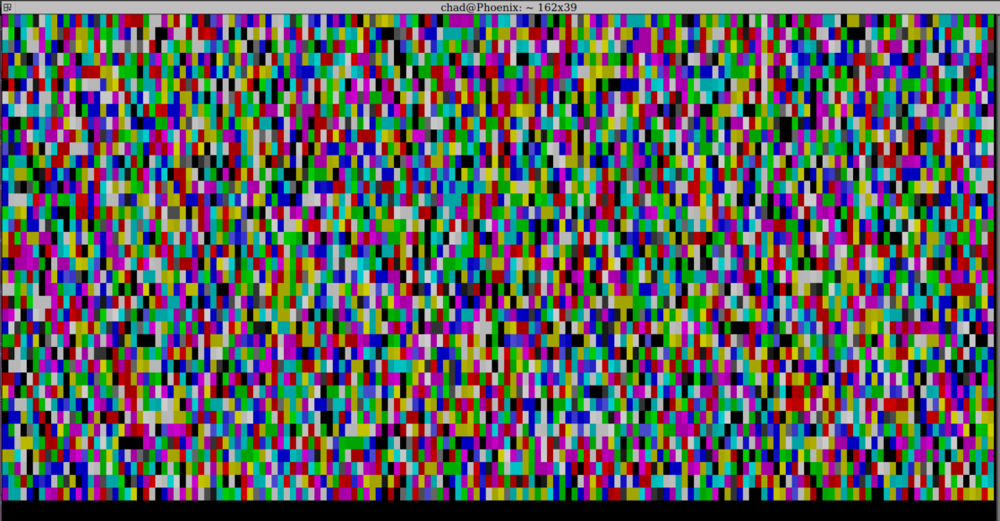
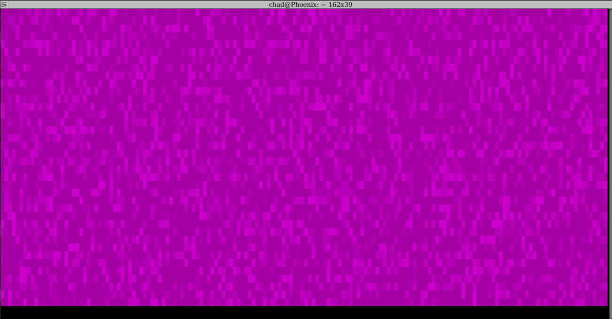

# digitalstatic
Digital Static / Snow with Python 3 and curses

### How to install
```pip install digital_static```

### To Run
```dstatic```

### Commands
- <kbd>Q</kbd> = to quit
- <kbd>b</kbd> = black and white mode
- <kbd>C</kbd> = color mode
- <kbd>c</kbd> = cycle color mode
- <kbd>d</kbd> = reset to default
- <kbd>0 to 9</kbd> = Delay

#### Colors
- <kbd>r</kbd> = red
- <kbd>t</kbd> = green
- <kbd>y</kbd> = blue
- <kbd>u</kbd> = yellow
- <kbd>i</kbd> = magenta
- <kbd>o</kbd> = cyan
- <kbd>p</kbd> = white
- <kbd>[</kbd> = black

### Screen Shots



